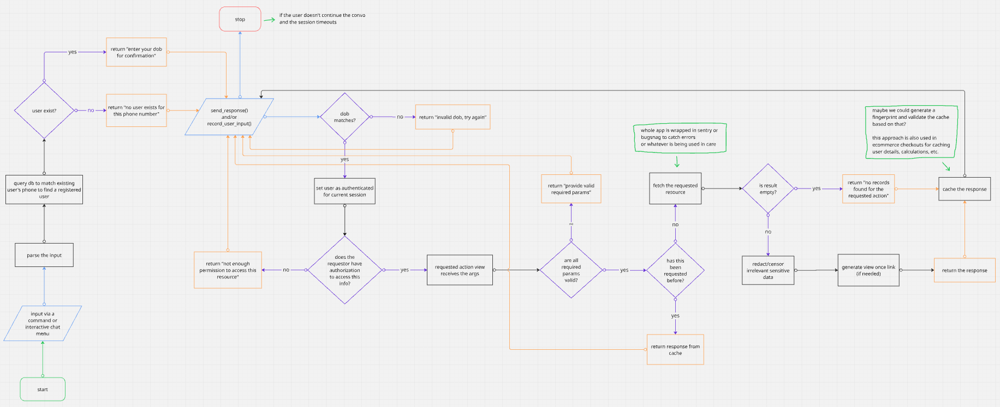

# IM Wrapper Proposal - Samiullah Javed

<table>
    <thead>
        <tr>
            <th width="203">Personal Details</th>
            <th>Description</th>
        </tr>
    </thead>
    <tbody>
        <tr>
            <td><strong>Name</strong></td>
            <td>Samiullah Javed</td>
        </tr>
        <tr>
            <td><strong>Organisation Details</strong></td>
            <td>College: Islamia Govt. Science College Sukkur Program: Computer Science Grade: 12th Expected Graduation Date: June 2026</td>
        </tr>
        <tr>
            <td><strong>Contact Details</strong></td>
            <td>Phone No: +92 326 3672475  Email ID: samiullahjavedd@gmail.com</td>
        </tr>
        <tr>
            <td><strong>Current Timezone</strong></td>
            <td>Pakistan Standard Time</td>
        </tr>
        <tr>
            <td><strong>Github Profile</strong> </td>
            <td><a href="https://github.com/8sami">https://github.com/8sami</a></td>
        </tr>
        <tr>
            <td><strong>Linkedin Profile</strong></td>
            <td><a href="https://www.linkedin.com/in/samiullahjaved">https://www.linkedin.com/in/samiullahjaved</a></td>
        </tr>
        <tr>
            <td><strong>Resume</strong></td>
            <td><a href="https://samiullahjaved.com/Samiullah_Javed.pdf">https://samiullahjaved.com/Samiullah_Javed.pdf</a></td>
        </tr>
        <tr>
            <td><strong>Portfolio Website</strong></td>
            <td><a href="https://samiullahjaved.com">https://samiullahjaved.com</a></td>
        </tr>
    </tbody>
</table>

#### Project Proposal

* **Title**: Whatsapp bot for CARE
* **Project Overview**:
    IM wrapper is a djano plugin based instant messaging provider meant to provide staff and patients ease of access to medical data through any messaging app, quickly and securely. Additionally, it also aims to add functionality of sending alerts and notifications via the configured messaging providers.

    Although the care web app already provides all the information, but people such as those living in rural/remote areas could greatly benefit from accessing their medical records and appointments through a simple message on whatsapp instead of having to navigate a web app which could prove difficult for people with limited digital exposure.

    The provider approach makes the instant messaging functionality independant of any messaging app, ensuring each one's support can be developed, maintained and tested without intefering with other messaging provider's implementation.

    Developing it as a plugin ensures that we wont have to worry about it interfering with care's backend. As a plugin, it can be removed, added, updated any time without affecting the core backend. This keeps the core backend clean and lean which ensures good maintainability and good developer experience.

    **Specification:**

    1. **Architecture**: Plugin based, using the [django plugin cookiecutter template](https://github.com/ohcnetwork/care-plugin-cookiecutter).
    2. **Authentication**: Two step authentication, first is matching the requestor's phone number with the number associated with a patient or staff member in the database. The second step is asking for DOB to confirm identity. If the requestor fails to provide correct DOB within 3 attempts, the request is blocked for 15 minutes.
    3. **Authorization**: The authorization is managed via the type of account (staff or patient) and roles permissions logic in the care backend. For example a patient can only access their own data, while a staff member can access the data of patients.
    4. **Caching**: Caching using redis to reduce latency and database load.
    5. **Rate Limiting**: Rate limiting and debouncing to prevent spam and abuse.
    6. **Error Handling**: Proper error handling.
    7. **Audit Logging**: Audit logging using the existing care.audit_log package.
    8. **Testing**: Proper tests using playwright and pytest.
    9. **Documentation**: Documentation using sphinx.
  
    **Flow of Program:**
    This flowchart helps illustrates the flow of program of the IM Wrapper (excluding the alert functionality):

    

    **Proof of Concept:**
    To support my claims and get hands on experience, I developed a working prototype of the IM Wrapper as a django plugin using the [django plugin cookiecutter template](https://github.com/ohcnetwork/care-plugin-cookiecutter).

    My plan was to architect it as an IM provider which could be extended to support any messaging app. Since it's a proof of concept, there are many things that could have been done better and many things are intentionally kept simple, but I believe it is somewhat successful in properly conveying my ideas.
    
    Below is the list of things I focused on implementing for the POC:

    * I have implemented the two step auth, in which the first step verifies the requestor's phone number with the number associated with a patient or staff member in the database. The second step asks for DOB to confirm identity. If the requestor fails to provide correct DOB within 3 attempts, all requests from that number are blocked for 15 minutes.
    * Proper state management is implemented so that the 'bot' is fool-proof and somewhat context-aware.
    * Configurable caching is also implemented. 
    * The plugin is using care.audit_log package to log all the events to comply with HIPAA security regulations.
    * Fetches live data instead of place holder dummy data.
    * Data sanitization is also implemented to prevent sending irrelevant sensitive information that could put PII of patients at risk.

    Below are the links to the Github repo and a YouTube video demonstration of the POC:

    * **Github repo**: [https://github.com/8sami/im-wrapper](https://github.com/8sami/im-wrapper)
    * **YouTube video**: [https://www.youtube.com/watch?v=wKRil3z-d5s](https://www.youtube.com/watch?v=wKRil3z-d5s)

    **Additional Information:**
    * setup scripts
    * docs
    * and questions here

    **Use Cases**:
    1. Since care provides teleICU services to many remote areas of India, it makes a lot of sense to provide ease of access to medical data to the people living in those areas where issues like internet connectivity, digial literacy and lack of access to computers are prevalent.
    2. Using messaging apps like whatsapp is more comfortable and easier to use for people because of its familiarity than navigating a web app, which can be daunting for some.
    3. Accessing information via whatsapp is much more convenient and faster than having to log in to the care web app.

        The image below aims to depict the time it may take to access information via both methods by showing the difference in number of steps:

        

* **Features**:
  1. List of five features I appreciate in the platform

#### Technical Skills and Relevant Experience

* My technical skills include Python, Javascript, Typescript, React, Nextjs, Django, Flask, SQL, Git, Github, Docker, Linux
* My first full stack project, "Simple Invoice Generator" was built using Django, weasyprint, crispy-bootstrap5 and jinja. That project recorded almost 2 Cr of transactions for a procurement service provider and then as I was developing its v2 using nextjs, shadcn, reactPDF and django ninja the business completed its tenure. I reviewed the code a few weeks ago... it needs a lot of work but I plan to deploy it as a free open source tool this year.

    I have a YOE working as a software dev remotely for an Australian agency where I got the chance to work on production grade code across various projects using different technologies. Working in a high stakes environment has taught me a lot about problem solving while respecting tight deadlines.

#### Implementation Timeline and Milestones

* Week-by-week plan outlining goals, tasks, and deliverables
* Specific milestones for project phases

#### Summary About Me

A short intro video: [Watch on YouTube](https://youtube.com/shorts/5Gx_Yw9gSZU?si=rSZAJvbkG9n7dxrv)

 I am a curious person. I like trying out new stuff and I mostly do things that seem fun to me. Problem solving and product development are one of those things that I very much enjoy doing. I have more than a YOE working as a software developer in an Australian agency where I resigned from in february to explore my interests and focus on my studies to try and get into MIT. I started programming when I was in 9th grade, as it seemed really interesting, and its just as fun now as it was back then.

 My motivation for winning gsoc is that it aligns with my goals, and I have also developed a love for open source in the process. I genuinely enjoy contributing to something bigger than me, something that would go on to live and make people's lives easier even after me.

#### Availability and Commitment

* 40-50 hours per week
* I'll be studying for SAT and training for national powerlifting competition for 2-3 hours daily. Will be done with Board exams by 25 april 2026 and I won't be preparing for entrance exams until next year.

#### Contribution to OHC Repo (if applicable)

* **Pull Requests**:
  1. <https://github.com/ohcnetwork/care_fe/pull/16144>
  2. <https://github.com/ohcnetwork/care_fe/pull/16086>
  3. <https://github.com/ohcnetwork/care_fe/pull/16085>
  4. <https://github.com/ohcnetwork/care_fe/pull/15828>
  5. <https://github.com/ohcnetwork/care_fe/pull/15546>
  6. <https://github.com/ohcnetwork/care_fe/pull/15454>
  7. <https://github.com/ohcnetwork/care_fe/pull/15098>

* **Issues**: 
  1. <https://github.com/ohcnetwork/care_fe/issues/15719>
  2. <https://github.com/ohcnetwork/care_fe/issues/15494>

* I am not sure if I should mention this, but I honestly really love guiding and helping other people out in the community :D